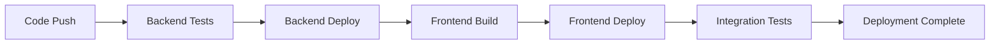

# Deployment Guide - GitHub Actions CI/CD

The jewelry manufacturing application uses automated GitHub Actions workflows for continuous integration and deployment. This guide covers both automated deployments and manual procedures.

## 🚀 Automated Deployment (Recommended)

### Overview

The application uses GitHub Actions workflows for automated CI/CD with:
- **Automated Testing**: Unit tests and property-based tests run on every push/PR
- **Environment Isolation**: Separate deployments for dev, staging, and production
- **Secure Authentication**: OIDC-based authentication (no long-lived AWS credentials)
- **Coordinated Deployment**: Backend deploys first, then frontend with the correct API URL

### Deployment Triggers

#### Automatic Deployments
- **Push to `main` branch**: Automatically deploys to **production**
- **Pull Request**: Runs tests and builds (no deployment)
- **Push to `develop` branch**: Automatically deploys to **development** (if configured)

#### Manual Deployments
- **Workflow Dispatch**: Deploy any branch to any environment manually

### Deployment Flow



1. **Backend Workflow** (`.github/workflows/deploy-backend.yml`)
   - Runs unit tests and property-based tests
   - Builds Lambda package with SAM
   - Deploys to AWS Lambda + API Gateway
   - Outputs API URL for frontend

2. **Frontend Workflow** (`.github/workflows/deploy-frontend.yml`)
   - Triggered after successful backend deployment
   - Builds React app with backend API URL
   - Deploys to S3 + CloudFront
   - Invalidates CDN cache

3. **Integration Tests** (`.github/workflows/integration-tests.yml`)
   - Runs end-to-end tests against deployed application
   - Validates API endpoints and frontend functionality

## 🎯 Manual Workflow Dispatch

### Deploy to Specific Environment

1. **Go to GitHub Actions**
   - Navigate to your repository on GitHub
   - Click **Actions** tab
   - Select **Deploy Backend** or **Deploy Frontend** workflow

2. **Run Workflow**
   - Click **Run workflow** button
   - Select the branch to deploy
   - Choose target environment (dev/staging/prod)
   - Click **Run workflow**

### Manual Deployment Examples

#### Deploy Feature Branch to Development
```
Workflow: Deploy Backend
Branch: feature/new-feature
Environment: dev
```

#### Deploy Release to Staging
```
Workflow: Deploy Backend  
Branch: release/v1.2.0
Environment: staging
```

#### Emergency Production Deployment
```
Workflow: Deploy Backend
Branch: hotfix/critical-fix
Environment: prod
```

## 📊 Workflow Monitoring and Debugging

### Monitoring Deployments

#### GitHub Actions Dashboard
1. Go to **Actions** tab in your repository
2. View running and completed workflows
3. Click on any workflow run to see detailed logs
4. Monitor deployment progress in real-time

#### Workflow Status Indicators
- 🟢 **Success**: Deployment completed successfully
- 🟡 **In Progress**: Deployment currently running
- 🔴 **Failed**: Deployment failed (check logs)
- ⚪ **Cancelled**: Deployment was cancelled

### Debugging Failed Deployments

#### Common Failure Points

1. **Test Failures**
   ```
   Location: Backend Tests job
   Cause: Unit tests or property-based tests failing
   Solution: Fix failing tests and push new commit
   ```

2. **Build Failures**
   ```
   Location: Build job
   Cause: Compilation errors, missing dependencies
   Solution: Check build logs, fix code issues
   ```

3. **AWS Authentication Failures**
   ```
   Location: Deploy job
   Cause: OIDC configuration issues, role permissions
   Solution: Verify AWS infrastructure setup
   ```

4. **Deployment Failures**
   ```
   Location: Deploy job  
   Cause: CloudFormation errors, resource conflicts
   Solution: Check AWS CloudFormation console
   ```

#### Debugging Steps

1. **Check Workflow Logs**
   - Click on failed workflow run
   - Expand failed job sections
   - Look for error messages and stack traces

2. **Verify AWS Infrastructure**
   ```bash
   cd aws-infrastructure
   ./validate-setup.sh
   ```

3. **Check AWS CloudFormation**
   - Go to AWS CloudFormation console
   - Look for failed stacks
   - Check stack events for error details

4. **Validate GitHub Secrets**
   - Go to Repository Settings → Secrets and variables → Actions
   - Verify all required secrets are present:
     - `AWS_REGION`
     - `AWS_ROLE_ARN_DEV`, `AWS_ROLE_ARN_STAGING`, `AWS_ROLE_ARN_PROD`
     - `SECRET_NAME_DEV`, `SECRET_NAME_STAGING`, `SECRET_NAME_PROD`

### Workflow Debugging Commands

#### View Workflow Status
```bash
# Using GitHub CLI
gh workflow list
gh run list --workflow="deploy-backend.yml"
gh run view RUN_ID
```

#### Check AWS Resources
```bash
# Check CloudFormation stacks
aws cloudformation list-stacks --stack-status-filter CREATE_COMPLETE UPDATE_COMPLETE

# Check Lambda functions
aws lambda list-functions --query 'Functions[?contains(FunctionName, `jewelry`)].FunctionName'

# Check S3 buckets
aws s3 ls | grep jewelry
```

## 🔄 Rollback Procedures

### Automated Rollback (Recommended)

#### Rollback via Git Revert
1. **Identify the problematic commit**
   ```bash
   git log --oneline
   ```

2. **Create revert commit**
   ```bash
   git revert COMMIT_SHA
   git push origin main
   ```

3. **Automatic redeployment**
   - GitHub Actions will automatically deploy the reverted code
   - Monitor the deployment in Actions tab

#### Rollback to Previous Release
1. **Find the last known good commit**
   ```bash
   git log --grep="deploy-prod" --oneline
   ```

2. **Create rollback branch**
   ```bash
   git checkout -b rollback/to-v1.1.0 GOOD_COMMIT_SHA
   git push origin rollback/to-v1.1.0
   ```

3. **Manual deployment**
   - Use workflow dispatch to deploy rollback branch to production

### Manual Rollback (Emergency)

#### Backend Rollback
```bash
# List Lambda versions
aws lambda list-versions-by-function --function-name jewelry-backend-prod

# Update alias to previous version
aws lambda update-alias \
  --function-name jewelry-backend-prod \
  --name live \
  --function-version PREVIOUS_VERSION
```

#### Frontend Rollback
```bash
# Restore from S3 backup (if available)
aws s3 sync s3://jewelry-frontend-backup-ACCOUNT-prod/ s3://jewelry-frontend-ACCOUNT-prod/ --delete

# Invalidate CloudFront cache
aws cloudfront create-invalidation \
  --distribution-id YOUR_DISTRIBUTION_ID \
  --paths "/*"
```

#### Database Rollback
```bash
# For schema changes, use Alembic downgrade
cd backend
alembic downgrade -1  # Rollback one migration
alembic downgrade REVISION_ID  # Rollback to specific revision
```

### Rollback Verification

After rollback, verify the application:

1. **Check API Health**
   ```bash
   curl https://your-api-url.com/health
   ```

2. **Check Frontend**
   - Visit the application URL
   - Verify core functionality works
   - Check browser console for errors

3. **Run Integration Tests**
   - Manually trigger integration test workflow
   - Verify all tests pass

## 🌍 Environment Management

### Environment Configuration

#### Development Environment
- **Trigger**: Push to `develop` branch (if configured)
- **Manual**: Workflow dispatch with `dev` environment
- **Resources**: `jewelry-*-dev` AWS resources
- **Database**: Development database
- **Domain**: `dev.yourdomain.com` (if configured)

#### Staging Environment  
- **Trigger**: Manual workflow dispatch only
- **Purpose**: Pre-production testing
- **Resources**: `jewelry-*-staging` AWS resources
- **Database**: Staging database (copy of production)
- **Domain**: `staging.yourdomain.com` (if configured)

#### Production Environment
- **Trigger**: Push to `main` branch
- **Manual**: Workflow dispatch with `prod` environment
- **Resources**: `jewelry-*-prod` AWS resources
- **Database**: Production database
- **Domain**: `yourdomain.com`

### Environment-Specific Deployments

#### Deploy to Development
```yaml
# Manual workflow dispatch
Branch: feature/my-feature
Environment: dev
```

#### Deploy to Staging
```yaml
# Manual workflow dispatch  
Branch: main
Environment: staging 
```

#### Deploy to Production
```yaml
# Automatic on main branch push
# Or manual workflow dispatch
Branch: main
Environment: prod
```

## 🔧 Legacy Manual Deployment (Deprecated)

> **⚠️ Warning**: Manual deployment scripts are deprecated. Use GitHub Actions workflows instead.

### Legacy Scripts (For Emergency Use Only)

The original deployment scripts are still available but should only be used in emergencies:

#### Backend Manual Deploy
```bash
cd backend
./deploy.sh
```

#### Frontend Manual Deploy  
```bash
cd frontend
./deploy.sh
```

**Important Documentation:**
- **Migration Guide**: See [MIGRATION-GUIDE.md](MIGRATION-GUIDE.md) for complete migration instructions
- **Backup Documentation**: See [MANUAL-DEPLOYMENT-BACKUP.md](MANUAL-DEPLOYMENT-BACKUP.md) for emergency manual deployment procedures

### Migration from Manual to Automated

If you're still using manual deployment:

1. **Read the migration guide**
   ```bash
   # Review complete migration instructions
   cat MIGRATION-GUIDE.md
   ```

2. **Set up AWS infrastructure** (if not done)
   ```bash
   cd aws-infrastructure
   ./deploy-infrastructure.sh deploy-all all
   ```

3. **Configure GitHub secrets** (from infrastructure output)

4. **Test automated deployment**
   - Create a test branch
   - Use workflow dispatch to deploy to dev environment
   - Verify everything works

5. **Switch to automated deployment**
   - Merge changes to main branch
   - Let GitHub Actions handle production deployments

6. **Archive manual scripts**
   - Manual scripts will show deprecation warnings
   - Keep for emergency backup only
   - See [MANUAL-DEPLOYMENT-BACKUP.md](MANUAL-DEPLOYMENT-BACKUP.md) for backup procedures

## 🔧 Advanced Deployment Operations

### Updating Individual Components

#### Backend-Only Updates
When you only need to update the backend:

1. **Automatic**: Push backend changes to main branch
   - GitHub Actions will deploy backend and frontend (frontend rebuild ensures API compatibility)

2. **Manual**: Use workflow dispatch
   - Select "Deploy Backend" workflow
   - Choose your branch and environment
   - Frontend will automatically redeploy with new API URL

#### Frontend-Only Updates
When you only need to update the frontend:

1. **Automatic**: Push frontend changes to main branch
   - Backend tests run but no redeployment occurs if backend unchanged
   - Frontend deploys with existing backend API URL

2. **Manual**: Use workflow dispatch
   - Select "Deploy Frontend" workflow
   - Requires existing backend deployment in target environment

### Deployment Customization

#### Custom Environment Variables
Add environment-specific variables to AWS Secrets Manager:

```bash
# Update secret for specific environment
aws secretsmanager update-secret \
  --secret-id jewelry-manufacturing-prod \
  --secret-string '{
    "DATABASE_URL": "postgresql://...",
    "JWT_SECRET_KEY": "...",
    "CORS_ORIGINS": "https://yourdomain.com",
    "ENVIRONMENT": "production",
    "CUSTOM_FEATURE_FLAG": "enabled"
  }'
```

#### Branch-Specific Deployments
Configure different branches for different environments:

```yaml
# In workflow files, add branch conditions
on:
  push:
    branches:
      - main        # Production
      - develop     # Development
      - release/*   # Staging
```

## 🗑️ Cleanup and Resource Management

### Automated Cleanup
GitHub Actions workflows include automatic cleanup:
- **Failed deployments**: Automatically cleaned up
- **Old Lambda versions**: Retained for rollback (configurable)
- **CloudFormation stacks**: Managed automatically

### Manual Cleanup

#### Delete Environment Resources
```bash
# Use infrastructure cleanup script
cd aws-infrastructure
./deploy-infrastructure.sh cleanup prod

# Or delete individual stacks
aws cloudformation delete-stack --stack-name jewelry-backend-prod
aws cloudformation delete-stack --stack-name jewelry-frontend-prod
```

#### Clean Up GitHub Actions Artifacts
```bash
# Using GitHub CLI
gh api repos/:owner/:repo/actions/artifacts --paginate | \
  jq '.artifacts[] | select(.expired == false) | .id' | \
  xargs -I {} gh api repos/:owner/:repo/actions/artifacts/{} -X DELETE
```

### Cost Management

#### Monitor Deployment Costs
- **Lambda**: Pay per request and execution time
- **S3**: Storage and data transfer costs
- **CloudFront**: Data transfer and request costs
- **Secrets Manager**: $0.40/month per secret + API calls

#### Cost Optimization Tips
1. **Use appropriate Lambda memory settings**
2. **Enable CloudFront compression**
3. **Set up S3 lifecycle policies for old deployments**
4. **Monitor and clean up unused resources**

## 📈 Monitoring and Observability

### Deployment Metrics

#### GitHub Actions Metrics
- **Deployment frequency**: How often deployments occur
- **Lead time**: Time from commit to production
- **Failure rate**: Percentage of failed deployments
- **Recovery time**: Time to recover from failures

#### AWS Monitoring
```bash
# CloudWatch metrics for Lambda
aws cloudwatch get-metric-statistics \
  --namespace AWS/Lambda \
  --metric-name Duration \
  --dimensions Name=FunctionName,Value=jewelry-backend-prod \
  --start-time 2023-01-01T00:00:00Z \
  --end-time 2023-01-02T00:00:00Z \
  --period 3600 \
  --statistics Average
```

### Alerting Setup

#### GitHub Actions Notifications
Configure notifications in `.github/workflows/notify-deployment.yml`:
- **Slack notifications** for deployment status
- **Email alerts** for production failures
- **Teams integration** for deployment approvals

#### AWS CloudWatch Alarms
```bash
# Create alarm for Lambda errors
aws cloudwatch put-metric-alarm \
  --alarm-name "jewelry-backend-prod-errors" \
  --alarm-description "Lambda function errors" \
  --metric-name Errors \
  --namespace AWS/Lambda \
  --statistic Sum \
  --period 300 \
  --threshold 5 \
  --comparison-operator GreaterThanThreshold \
  --dimensions Name=FunctionName,Value=jewelry-backend-prod
```

## 🔐 Security Best Practices

### Deployment Security

#### OIDC Security
- **No long-lived credentials** stored in GitHub
- **Temporary tokens** with 1-hour maximum lifetime
- **Repository-specific access** via trust policies
- **Environment isolation** with separate IAM roles

#### Secret Management
- **Centralized secrets** in AWS Secrets Manager
- **Environment-specific access** controls
- **Automatic rotation** support (configure as needed)
- **Audit logging** of all secret access

#### Network Security
- **API Gateway** with throttling and WAF (configure as needed)
- **CloudFront** with security headers
- **VPC endpoints** for internal AWS communication (optional)

### Security Monitoring

#### AWS CloudTrail
Monitor these events for security:
- `AssumeRoleWithWebIdentity` (OIDC authentication)
- `GetSecretValue` (secret access)
- `CreateFunction`, `UpdateFunctionCode` (Lambda changes)

#### GitHub Security
- **Branch protection rules** for main branch
- **Required status checks** before merge
- **Signed commits** (recommended)
- **Dependabot alerts** for vulnerable dependencies

## 💡 Benefits of GitHub Actions CI/CD

### Advantages Over Manual Deployment

- ✅ **Consistency**: Same deployment process every time
- ✅ **Security**: No long-lived AWS credentials
- ✅ **Auditability**: Full deployment history in GitHub
- ✅ **Testing**: Automated tests before deployment
- ✅ **Rollback**: Easy rollback via Git operations
- ✅ **Coordination**: Backend and frontend deploy together
- ✅ **Environment Parity**: Same process for all environments
- ✅ **Team Collaboration**: Visible deployment status for all team members

### Performance Benefits

- **Faster deployments**: Parallel job execution
- **Dependency caching**: Faster builds with cached dependencies
- **Incremental deployments**: Only changed components deploy
- **CDN optimization**: Automatic CloudFront cache invalidation

### Operational Benefits

- **Reduced human error**: Automated, repeatable process
- **24/7 deployments**: No manual intervention required
- **Deployment metrics**: Built-in monitoring and reporting
- **Integration**: Works with existing GitHub workflow

## 📚 Additional Resources

### Documentation Links
- [AWS Infrastructure Setup Guide](AWS-INFRASTRUCTURE-SETUP.md)
- [GitHub Actions Workflows](.github/workflows/README.md)
- [Backend README](backend/README.md)
- [Frontend README](frontend/README.md)

### Troubleshooting Resources
- [AWS CloudFormation Console](https://console.aws.amazon.com/cloudformation/)
- [GitHub Actions Documentation](https://docs.github.com/en/actions)
- [AWS SAM Documentation](https://docs.aws.amazon.com/serverless-application-model/)
- [OIDC Troubleshooting Guide](https://docs.github.com/en/actions/deployment/security-hardening-your-deployments/about-security-hardening-with-openid-connect)

### Support Contacts
- **Infrastructure Issues**: Check AWS CloudFormation and IAM console
- **GitHub Actions Issues**: Review workflow logs and GitHub Actions documentation
- **Application Issues**: Check CloudWatch logs for Lambda and application metrics
